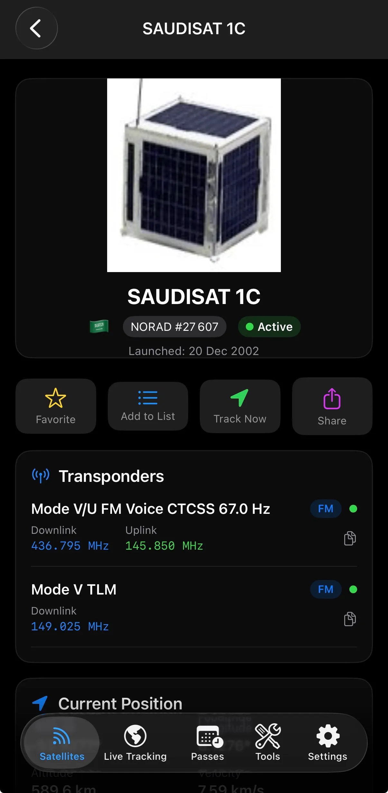
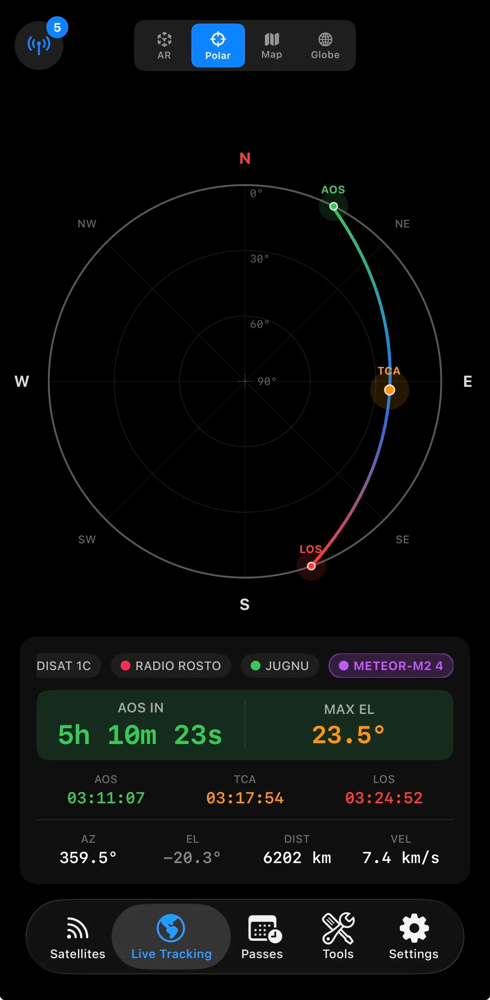
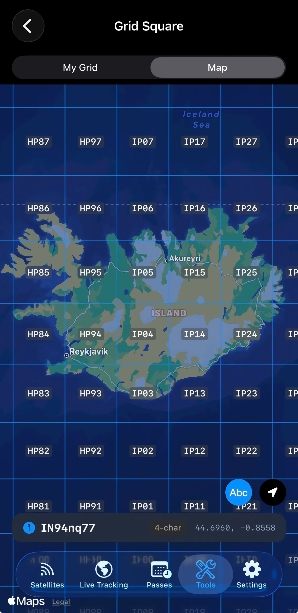

<h1 align="center">🛰️ AllMySat</h1>

  <strong>Your companion app for satellite lovers</strong> 
  Track 10,000+ satellites in real-time with precise orbital data. 
  <em>Built for radio amateurs and space enthusiasts.</em>

---

## 📸 Features

  
  &nbsp;&nbsp;
  
  &nbsp;&nbsp;
  
  &nbsp;&nbsp;
  

- **3D Globe Tracking** — Interactive visualization of satellite positions and ground tracks
- **10,000+ Satellites** — Complete orbital database with real-time TLE updates
- **Pass Predictions** — Upcoming satellite passes with elevation & azimuth data
- **Grid Square Locator** — Automatic Maidenhead calculation for amateur radio contacts
- **Transmitter Info** — Downlink frequencies and modes for each satellite

---

### Sync Jobs

| Route | Schedule | Description |
|-------|----------|-------------|
| `/api/cron/sync-tle` | Every 6h | Sync TLE orbital data from CelesTrak |
| `/api/cron/sync-transmitters` | Daily | Sync transmitter data from SatNOGS |
| `/api/cron/decayed` | Weekly | Mark decayed satellites |

## 🛠️ Tech Stack

| Layer | Technology |
|-------|-----------|
| **Framework** | Next.js 14 (App Router) |
| **Language** | TypeScript |
| **Styling** | Tailwind CSS |
| **3D Globe** | three-globe + React Three Fiber |
| **Animations** | Framer Motion |
| **Database** | Supabase (PostgreSQL) |
| **Hosting** | Vercel |